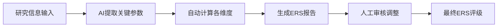

# Evidence Robustness Score (ERS)

> **版本**: v2.5.1  
> **定位**: 扩展FI至非RCT证据的稳健性评估框架  
> **适用**: 影像学观察、生物力学实验、组学分析、队列研究等非二元结局研究

---

## 1. 背景与原理

### 1.1 为什么需要ERS？

**Fragility Index (FI) 的局限性**:
- 仅适用于二元结局的RCT
- 无法评估影像学、生物力学、组学等非RCT证据
- LDH综述中大量证据来自MRI观察、生物力学测试、基因表达分析

**ERS的设计目标**:
- 覆盖全证据类型
- 量化非随机研究的稳健性
- 与FI互补，形成完整的证据稳健性评估体系

### 1.2 ERS vs FI 对比

| 维度 | FI | ERS |
|-----|----|-----|
| 适用研究类型 | RCT（二元结局） | 全类型 |
| 核心问题 | "多少病例改变结论会逆转" | "当前证据的抗干扰能力如何" |
| 评估维度 | 统计显著性稳健性 | 样本量、方法学、一致性 |
| LDH应用场景 | 手术vs保守治疗的RCT | MRI形态学研究、生物力学测试 |

---

## 2. ERS计算框架

### 2.1 维度与权重

```
ERS = Σ(维度得分 × 权重)

维度构成:
├── 样本量稳健性 (25%)
├── 方法学严谨性 (30%)
├── 效应量稳定性 (25%)
├── 结果一致性 (15%)
└── 可重复性 (5%)
```

### 2.2 各维度评分标准

#### 维度1: 样本量稳健性 (Sample Size Robustness)

**计算基础**: 统计功效分析

```python
def sample_size_score(n, effect_size, alpha=0.05, power_target=0.8):
    """
    基于后验功效分析评估样本量充足度
    """
    observed_power = calculate_power(n, effect_size, alpha)
    
    if observed_power >= 0.9:
        return 1.0  # 优秀
    elif observed_power >= 0.8:
        return 0.8  # 良好
    elif observed_power >= 0.6:
        return 0.5  # 可接受
    else:
        return 0.2  # 不足
```

**评分表**:

| 后验功效 | 评分 | 解释 |
|---------|------|------|
| ≥90% | 1.0 | 样本量充足，结论稳健 |
| 80-89% | 0.8 | 样本量可接受 |
| 60-79% | 0.5 | 样本量边缘，需谨慎解读 |
| <60% | 0.2 | 样本量不足，结论不可靠 |

#### 维度2: 方法学严谨性 (Methodological Rigor)

**评估要素**:

| 要素 | 权重 | 评估标准 |
|-----|------|---------|
| 测量工具信度 | 30% | ICC>0.8=1.0, 0.7-0.8=0.7, <0.7=0.4 |
| 混杂控制 | 30% | 多变量校正+1.0, 单变量+0.6, 未校正+0.2 |
| 盲法实施 | 20% | 双盲+1.0, 单盲+0.7, 开放+0.3 |
| 选择性报告 | 20% | 预注册+1.0, 有方案+0.8, 无+0.4 |

**评分示例（影像学观察研究）**:

```markdown
## 方法学严谨性评估：MRI椎管狭窄测量研究

| 要素 | 评估 | 得分 |
|-----|------|------|
| 测量工具信度 | ICC=0.85（高信度） | 1.0 |
| 混杂控制 | 校正年龄、BMI、退变等级 | 1.0 |
| 盲法实施 | 测量者不知晓临床结局 | 0.7 |
| 选择性报告 | 未预注册，但有详细方法 | 0.6 |
| **加权总分** | | **0.84** |
```

#### 维度3: 效应量稳定性 (Effect Size Stability)

**评估方法**: 敏感性分析

```
评分标准:
- 排除极端值后效应量变化<10%: 1.0
- 变化10-20%: 0.7
- 变化20-30%: 0.4
- 变化>30%或方向改变: 0.1
```

**评估维度**:
1. 排除异常值敏感性
2. 不同统计模型敏感性
3. 亚组分析稳定性

#### 维度4: 结果一致性 (Consistency)

**评估内容**:

```markdown
## 一致性评估

### 内部一致性
- [ ] 主要结局与次要结局方向一致 (+0.3)
- [ ] 不同时间点结果稳定 (+0.3)
- [ ] 主要分析与敏感性分析一致 (+0.4)

### 外部一致性
- [ ] 与现有文献方向一致 (+0.3)
- [ ] 效应量处于合理范围 (+0.3)
- [ ] 机制解释符合生物学逻辑 (+0.4)
```

#### 维度5: 可重复性 (Reproducibility)

**评估内容**:

| 要素 | 评分 |
|-----|------|
| 原始数据可获取 | +0.3 |
| 分析代码公开 | +0.3 |
| 方法描述充分（可复现） | +0.2 |
| 独立团队验证过 | +0.2 |

---

## 3. ERS等级划分

### 3.1 分数等级

| ERS范围 | 等级 | 解释 | 建议 |
|--------|------|------|------|
| 0.90-1.00 | A (Excellent) | 证据高度稳健 | 可放心引用作为核心证据 |
| 0.75-0.89 | B (Good) | 证据稳健 | 良好证据，小瑕疵 |
| 0.60-0.74 | C (Fair) | 证据中等 | 可引用，但需注明局限性 |
| 0.40-0.59 | D (Weak) | 证据较弱 | 谨慎引用，仅作辅助 |
| <0.40 | E (Poor) | 证据薄弱 | 不建议作为支持证据 |

### 3.2 与GRADE的集成

```
GRADE评级调整规则:

基础评级（基于研究设计）:
- RCT: ⊕⊕⊕⊕ (高)
- 观察性研究: ⊕⊕◯◯ (低)

根据ERS调整:
- ERS ≥0.80: 不降级或升级1级
- ERS 0.60-0.79: 维持或降级1级
- ERS <0.60: 降级1-2级

示例:
队列研究 (基础⊕⊕◯◯) + ERS=0.85 → 不降级 (⊕⊕⊕◯)
队列研究 (基础⊕⊕◯◯) + ERS=0.45 → 降级2级 (⊕◯◯◯)
```

---

## 4. 不同研究类型的ERS评估

### 4.1 影像学观察研究

**特点**: MRI/CT形态学测量、信号强度评估

**评估重点**:
- 测量者间信度 (Inter-rater reliability)
- 测量标准化程度
- 影像学-临床相关性

**示例**:

```markdown
## ERS评估：椎间盘突出体积与症状严重度相关性研究

### 基本信息
- 研究设计: 横断面观察研究
- 样本量: n=156
- 主要结局: 突出体积 vs VAS评分相关性

### 各维度评分

| 维度 | 得分 | 说明 |
|-----|------|------|
| 样本量稳健性 | 0.8 | 检测到r=0.3的功效=82% |
| 方法学严谨性 | 0.75 | MRI测量ICC=0.82，测量者盲法 |
| 效应量稳定性 | 0.7 | 排除极端值后r从0.35降至0.31 |
| 结果一致性 | 0.8 | 与3项既往研究结果方向一致 |
| 可重复性 | 0.5 | 方法描述充分，但未公开数据 |
| **加权总分** | **0.75** | **等级: B (Good)** |

### 建议
可引用作为支持证据，但需注明："中等样本量观察性研究，效应量中等"
```

### 4.2 生物力学实验

**特点**: 尸体标本测试、有限元分析

**评估重点**:
- 标本质量与保存
- 加载条件模拟真实性
- 测量精度

### 4.3 组学研究

**特点**: 基因表达、蛋白质组学、代谢组学

**评估重点**:
- 多重检验校正
- 批次效应控制
- 验证队列

---

## 5. 在Evidence Audit Trail中的集成

```markdown
## Evidence Audit Trail

- **引用 ID**: Wang2023_MRI_LDH
- **研究类型**: 影像学横断面研究
- **GRADE 评级**: ⊕⊕⊕◯ (中等确定性)
- **ERS 评分**: 0.75 (B级 - Good)
- **硬锚点**: "突出体积与VAS评分呈正相关 (r=0.35, P<0.001)"
- 
### ERS详细评估
- **样本量稳健性**: 0.8 - n=156，检测中等效应量的功效充足
- **方法学严谨性**: 0.75 - MRI测量ICC=0.82，测量者盲法
- **效应量稳定性**: 0.7 - 敏感性分析中效应量稳定
- **结果一致性**: 0.8 - 与既往3项研究结果一致
- **可重复性**: 0.5 - 方法描述充分但未共享数据

### 降级/升级理由
- **降级**: 观察性研究设计（固有局限性）
- **不升级**: ERS=0.75未达到升级阈值(0.85)

### 审核状态**: ✅ 已核对
```

---

## 6. 自动化评估工具

### 6.1 AI辅助ERS评估流程



### 6.2 提示词模板

```markdown
请对以下研究进行Evidence Robustness Score评估：

【研究信息】
- 标题: [研究标题]
- 设计: [研究设计]
- 样本量: [n]
- 主要发现: [效应量和置信区间]
- 方法学细节: [测量方法、校正变量、盲法等]

请输出：
1. 各维度评分（0-1分）及理由
2. 加权总分和等级
3. 主要局限性
4. 引用建议
```

---

## 7. 与FI的联合应用

```markdown
## 证据稳健性综合评估

### RCT证据（二元结局）
- **FI**: 12 (稳健)
- **解释**: 需要改变12个病例的结果才能改变统计显著性
- **建议**: 高质量RCT证据，可放心引用

### 观察性证据（连续结局）
- **ERS**: 0.78 (B级 - Good)
- **解释**: 样本量充足，方法学良好，效应量稳定
- **建议**: 良好证据，可引用但需注明观察性设计局限

### 实验室证据（组学）
- **ERS**: 0.55 (D级 - Weak)
- **解释**: 样本量小(n=20)，缺乏验证队列
- **建议**: 仅作为机制假说支持，不宜作为主要证据
```

---

*文档版本: v2.5.1*  
*最后更新: 2026-03-13*