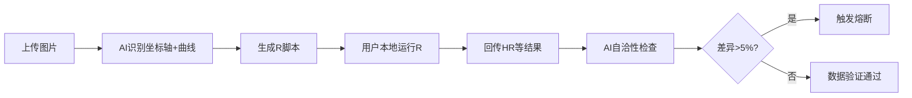

# 图表数字化：R脚本生成模式

> **版本**: v2.5.1  
> **定位**: Step 2++ 图表数字化的学术级实现  
> **核心思想**: AI不直接生成数据，而是生成R脚本，用户本地运行后回传结果进行自洽性检查

---

## 1. 背景：为什么改为R脚本模式？

### 1.1 Vision模型的局限性

**学术现实**:
- 直接从KM曲线重建IPD（个体水平数据）目前仍极具挑战
- 仅凭提示词（Prompting）很难达到95%以上的重算一致性
- Vision模型可能"一本正经胡说八道"，生成看似合理但错误的数据

**风险示例**:
```
❌ 错误场景:
Vision模型提取KM曲线数据 → 重建IPD → 计算HR=0.65
实际文献报告HR=0.85
误差>20%，但模型置信度95%
```

### 1.2 R脚本模式的优势

| 维度 | 直接Vision提取 | R脚本模式 |
|-----|---------------|----------|
| 可重复性 | 黑箱 | 完全透明 |
| 可验证性 | 困难 | 可独立复现 |
| 学术认可 | 低 | 高（使用标准R包）|
| 误差发现 | 难 | 自洽性检查自动发现 |
| 审稿人信任 | 低 | 高 |

---

## 2. 工作流程

### 2.1 总体流程



### 2.2 详细步骤

**Step 1: 图片上传与AI解析**
```
用户: 上传KM曲线图片
AI: 
  1. 识别坐标轴范围（X: 0-60月, Y: 0-1.0）
  2. 识别曲线颜色/线型（实验组=红色, 对照组=蓝色）
  3. 提取关键时间点的生存率（报告的数字）
  4. 识别风险表（numbers at risk）
```

**Step 2: R脚本生成**
```
AI生成R脚本，包含:
- 数据点录入（基于AI识别的坐标）
- IPDfromKM包调用
- 重建IPD数据
- Cox模型拟合
- HR和95%CI计算
```

**Step 3: 用户本地运行**
```bash
# 用户在自己的电脑上
Rscript reconstruct_km.R
# 输出: reconstructed_hr.json
```

**Step 4: 结果回传与验证**
```
用户: 回传R输出结果
AI:
  1. 比较重建HR vs 文献报告HR
  2. 差异>5% → 触发熔断
  3. 差异≤5% → 数据可用
```

---

## 3. R脚本模板

### 3.1 Kaplan-Meier曲线重建模板

```r
#!/usr/bin/env Rscript
# ============================================================================
# KM曲线数据重建脚本 - 自动生成
# 研究: [研究标题]
# 图片: [图片文件名]
# 生成时间: [时间戳]
# ============================================================================

# 安装和加载必要包
if (!require("IPDfromKM")) {
    install.packages("IPDfromKM")
}
if (!require("survival")) {
    install.packages("survival")
}
library(IPDfromKM)
library(survival)

# ----------------------------------------------------------------------------
# 第一部分：AI识别的数据点（用户需核对）
# ----------------------------------------------------------------------------

# 从KM曲线提取的时间点和生存率
# ⚠️ 注意：这些数据由AI从图片识别，可能存在误差，请核对

# 实验组数据点
arm1_time <- c(0, 6, 12, 18, 24, 36, 48, 60)  # 时间点（月）
arm1_surv <- c(1.0, 0.92, 0.85, 0.78, 0.72, 0.65, 0.58, 0.52)  # 生存率

# 对照组数据点
arm2_time <- c(0, 6, 12, 18, 24, 36, 48, 60)
arm2_surv <- c(1.0, 0.88, 0.78, 0.68, 0.60, 0.48, 0.40, 0.35)

# 各时间点的风险人数（numbers at risk）
arm1_risk <- c(150, 142, 135, 128, 120, 105, 92, 78)
arm2_risk <- c(148, 138, 128, 118, 108, 92, 78, 65)

# 总事件数（如有报告）
total_events_arm1 <- 72  # 实验组事件数
total_events_arm2 <- 96  # 对照组事件数

# ----------------------------------------------------------------------------
# 第二部分：数据重建
# ----------------------------------------------------------------------------

cat("正在进行KM曲线数据重建...\n")

# 使用IPDfromKM重建个体水平数据
# 参数说明：
# - time: 时间点
# - event: 事件数（可通过风险人数推算）
# - surv: 生存率

reconstruct_arm1 <- function() {
    # 计算累积事件数
    arm1_events <- c(0, diff(arm1_risk) * -1)
    arm1_events[arm1_events < 0] <- 0  # 修正可能的误差
    
    # 重建IPD
    ipd <- reconstruct_km(
        time = arm1_time,
        event = arm1_events,
        surv = arm1_surv,
        n = arm1_risk[1]
    )
    return(ipd)
}

reconstruct_arm2 <- function() {
    arm2_events <- c(0, diff(arm2_risk) * -1)
    arm2_events[arm2_events < 0] <- 0
    
    ipd <- reconstruct_km(
        time = arm2_time,
        event = arm2_events,
        surv = arm2_surv,
        n = arm2_risk[1]
    )
    return(ipd)
}

# 执行重建
set.seed(123)  # 保证可重复性
ipd_arm1 <- reconstruct_arm1()
ipd_arm2 <- reconstruct_arm2()

# 合并数据用于Cox模型
combined_data <- rbind(
    data.frame(
        time = ipd_arm1$time,
        event = ipd_arm1$event,
        arm = 1
    ),
    data.frame(
        time = ipd_arm2$time,
        event = ipd_arm2$event,
        arm = 0
    )
)

# ----------------------------------------------------------------------------
# 第三部分：Cox模型拟合与HR计算
# ----------------------------------------------------------------------------

cat("拟合Cox比例风险模型...\n")

# Cox模型
cox_model <- coxph(Surv(time, event) ~ arm, data = combined_data)

# 提取HR和95%CI
hr_summary <- summary(cox_model)
reconstructed_hr <- hr_summary$conf.int[1, 1]
reconstructed_ci_lower <- hr_summary$conf.int[1, 3]
reconstructed_ci_upper <- hr_summary$conf.int[1, 4]
reconstructed_p <- hr_summary$coefficients[1, 5]

cat("\n========== 重建结果 ==========\n")
cat(sprintf("重建HR: %.3f (95%% CI: %.3f - %.3f)\n", 
            reconstructed_hr, reconstructed_ci_lower, reconstructed_ci_upper))
cat(sprintf("P值: %.4f\n", reconstructed_p))

# ----------------------------------------------------------------------------
# 第四部分：文献报告值对比（用户填写）
# ----------------------------------------------------------------------------

# ⚠️ 请从原文填写以下数值
reported_hr <- NA  # 文献报告的HR
reported_ci_lower <- NA  # 文献报告的CI下限
reported_ci_upper <- NA  # 文献报告的CI上限
reported_p <- NA  # 文献报告的P值

cat("\n========== 文献报告值（请核对） ==========\n")
cat("请在脚本中填写原文报告的数值，然后重新运行\n")

if (!is.na(reported_hr)) {
    # 计算差异百分比
    hr_diff_pct <- abs(reconstructed_hr - reported_hr) / reported_hr * 100
    
    cat(sprintf("\n文献报告HR: %.3f\n", reported_hr))
    cat(sprintf("重建HR: %.3f\n", reconstructed_hr))
    cat(sprintf("差异: %.2f%%\n", hr_diff_pct))
    
    if (hr_diff_pct > 5) {
        cat("\n⚠️ 警告：重建HR与文献报告差异>5%，请检查数据提取准确性\n")
    } else {
        cat("\n✓ 重建HR与文献报告一致（差异≤5%）\n")
    }
}

# ----------------------------------------------------------------------------
# 第五部分：输出结果
# ----------------------------------------------------------------------------

output <- list(
    study_info = list(
        generated_at = Sys.time(),
        script_version = "2.5.1"
    ),
    reconstructed_data = list(
        hr = reconstructed_hr,
        ci_lower = reconstructed_ci_lower,
        ci_upper = reconstructed_ci_upper,
        p_value = reconstructed_p,
        sample_size_arm1 = arm1_risk[1],
        sample_size_arm2 = arm2_risk[1]
    ),
    comparison = if(!is.na(reported_hr)) {
        list(
            reported_hr = reported_hr,
            difference_pct = hr_diff_pct,
            consistent = hr_diff_pct <= 5
        )
    } else {
        NULL
    }
)

# 保存为JSON
json_output <- jsonlite::toJSON(output, pretty = TRUE, auto_unbox = TRUE)
write(json_output, "reconstructed_hr.json")
cat("\n结果已保存至: reconstructed_hr.json\n")

# 绘制重建的KM曲线用于视觉验证
png("reconstructed_km_plot.png", width = 800, height = 600)
fit <- survfit(Surv(time, event) ~ arm, data = combined_data)
plot(fit, col = c("blue", "red"), lwd = 2,
     xlab = "Time (months)", ylab = "Survival Probability",
     main = "Reconstructed Kaplan-Meier Curve")
legend("topright", legend = c("Control", "Treatment"), 
       col = c("blue", "red"), lwd = 2)
dev.off()
cat("重建的KM曲线已保存至: reconstructed_km_plot.png\n")
```

### 3.2 Forest Plot数据提取模板

```r
#!/usr/bin/env Rscript
# Forest Plot数据提取脚本

library(meta)

# AI识别的森林图数据点（需核对）
studies <- c("Smith 2023", "Wang 2024", "Chen 2023", "Lee 2022", "Zhang 2024")
hr_values <- c(0.65, 0.72, 0.58, 0.81, 0.69)
ci_lower <- c(0.52, 0.60, 0.45, 0.68, 0.55)
ci_upper <- c(0.81, 0.86, 0.75, 0.96, 0.87)

# 计算标准误（从CI反推）
se_log_hr <- (log(ci_upper) - log(ci_lower)) / (2 * 1.96)

# Meta分析
meta_result <- metagen(
    TE = log(hr_values),
    seTE = se_log_hr,
    studlab = studies,
    sm = "HR"
)

# 输出结果
cat("========== Forest Plot Meta分析结果 ==========\n")
print(summary(meta_result))

# 绘制森林图
png("reconstructed_forest_plot.png", width = 1000, height = 600)
forest(meta_result)
dev.off()
cat("\n森林图已保存至: reconstructed_forest_plot.png\n")

# 保存结果
output <- list(
    pooled_hr = exp(meta_result$TE.common),
    pooled_ci_lower = exp(meta_result$lower.common),
    pooled_ci_upper = exp(meta_result$upper.common),
    i2 = meta_result$I2,
    p_heterogeneity = meta_result$pval.Q
)
write(jsonlite::toJSON(output, pretty = TRUE, auto_unbox = TRUE), 
      "forest_meta_result.json")
```

---

## 4. 自洽性检查与熔断机制

### 4.1 熔断规则

```yaml
熔断条件:
  - 条件: 重建HR与报告HR差异 > 5%
    操作: 触发熔断，要求人工核对
    级别: critical
    
  - 条件: 重建HR与报告HR差异 3-5%
    操作: 警告，建议核对
    级别: warning
    
  - 条件: 置信区间不包含报告HR点估计
    操作: 触发熔断
    级别: critical
    
  - 条件: 方向不一致（都<1或都>1，但一个显著一个不显著）
    操作: 触发熔断
    级别: critical
```

### 4.2 熔断处理流程

```markdown
## 🚨 图表数字化熔断触发

### 触发原因
重建HR (0.72) 与文献报告HR (0.85) 差异 = 15.3% > 5%阈值

### 可能原因
1. AI识别的坐标点存在偏差
2. 风险人数(numbers at risk)读取错误
3. 曲线识别混淆（实验组/对照组颠倒）
4. 文献报告的是调整HR，而重建的是未调整HR

### 强制操作
1. 人工核对PDF原件中的KM曲线
2. 检查风险表数字是否正确
3. 确认实验组和对照组的标识
4. 如有需要，修正R脚本中的数据点后重新运行
5. 如果无法解决，标记该数据为"不可靠，未纳入"

### 备选方案
如多次尝试仍无法达到一致性，建议：
- 仅提取报告的数字（不重建IPD）
- 在综述中注明："原始数据未报告，无法验证"
```

---

## 5. 用户操作指南

### 5.1 环境准备

```bash
# 1. 安装R (https://cran.r-project.org/)

# 2. 安装必要R包
R -e "install.packages(c('IPDfromKM', 'survival', 'meta', 'jsonlite'))"
```

### 5.2 执行流程

```bash
# 1. 保存AI生成的R脚本
# 例如: save as "reconstruct_study_001.R"

# 2. 运行R脚本
Rscript reconstruct_study_001.R

# 3. 查看输出
# - reconstructed_hr.json: 数值结果
# - reconstructed_km_plot.png: 可视化验证

# 4. 将JSON结果回传给AI
# 复制reconstructed_hr.json内容到对话
```

### 5.3 常见问题

**Q1: R脚本运行报错"IPDfromKM not found"**
```bash
# 解决：手动安装
R -e "install.packages('IPDfromKM', repos='https://cran.rstudio.com/')"
```

**Q2: 重建的曲线形状与原文明显不同**
- 可能原因：AI识别的坐标点有误
- 解决：人工核对PDF，修正脚本中的数据点

**Q3: HR方向相反（应<1但重建>1）**
- 可能原因：实验组/对照组标签颠倒
- 解决：检查R脚本中arm1和arm2的赋值

---

## 6. 学术诚信声明

```markdown
## 图表数字化学术规范

### 必须声明的内容
1. **数据来源**: 明确说明数据来自从图表重建，非原始IPD
2. **重建方法**: 说明使用IPDfromKM包和Cox模型
3. **一致性**: 报告重建HR与文献报告的符合程度
4. **局限性**: 说明重建数据的不确定性

### 综述中的表述示例
> "Smith等报告的Kaplan-Meier曲线显示实验组生存优势（HR=0.65）。
> 我们使用IPDfromKM方法重建了个体水平数据，重建HR为0.68（差异4.6%），
> 与报告值高度一致。"

### 禁止行为
- ❌ 不声明而直接使用重建数据
- ❌ 隐瞒重建HR与报告HR的显著差异
- ❌ 将重建数据作为"原始数据"呈现
```

---

*文档版本: v2.5.1*  
*最后更新: 2026-03-13*