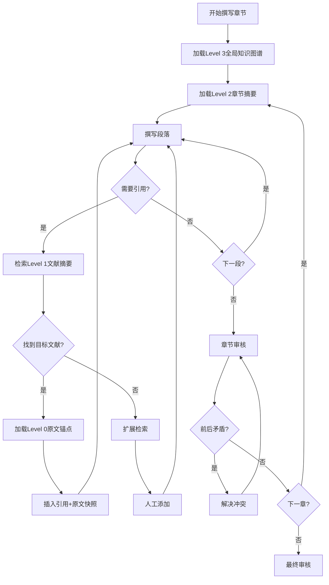

# Recursive Summary + Anchor Index 架构

> **版本**: v2.5.1  
> **定位**: 解决Step 6-7长文本撰写时的Context Window灾难  
> **核心思想**: AI不实时持有所有原文，而是持有高精度"知识索引表"，按需动态调用

---

## 1. 问题背景

### 1.1 Context Window灾难

**症状**:
- Step 6-7综述撰写时，需要引用大量文献的Evidence Audit Trail
- 原文快照、数据表格、方法学细节占用大量token
- AI遗忘Step -1的"世界观"和核心叙事逻辑
- 前后章节论述出现矛盾

**根本原因**:
- 传统RAG：检索片段直接放入上下文
- 证据综述：需要同时维护全局叙事+局部细节
- 超过Context Window后，AI"失忆"

### 1.2 传统方案局限

| 方案 | 问题 |
|-----|------|
| 简单截断 | 丢失关键证据细节 |
| 压缩摘要 | 丢失原文精确表述 |
| 分章节处理 | 失去全局一致性 |
| 外部向量库 | 检索精度不足 |

---

## 2. 架构设计

### 2.1 核心概念

```
Recursive Summary + Anchor Index = 
  分层摘要体系 + 精确锚点索引 + 动态按需加载
```

**分层摘要**:
```
Level 0: 原始文献全文 (存储于外部，不常驻上下文)
    ↓
Level 1: 文献微摘要 (100-200字/篇，常驻)
    ↓
Level 2: 章节知识摘要 (每章节500-1000字，按需加载)
    ↓
Level 3: 全局知识图谱 (综述世界观，始终常驻)
```

**锚点索引**:
- 每个核心观点关联到具体文献的精确位置
- 撰写时按需检索原文片段
- 确保引用准确性

### 2.2 架构图示

```
┌─────────────────────────────────────────────────────────────┐
│                     常驻上下文 (始终加载)                     │
│  ┌──────────────────────────────────────────────────────┐   │
│  │  Level 3: 全局知识图谱                                │   │
│  │  - 综述世界观 (Step -1产出)                           │   │
│  │  - 核心叙事主线                                       │   │
│  │  - 各章节定位关系                                     │   │
│  └──────────────────────────────────────────────────────┘   │
│  ┌──────────────────────────────────────────────────────┐   │
│  │  Level 2: 当前章节知识摘要 (动态切换)                  │   │
│  │  - 本章节核心观点                                     │   │
│  │  - 关键证据索引                                       │   │
│  │  - 争议点与Conflict Resolver结果                      │   │
│  └──────────────────────────────────────────────────────┘   │
└─────────────────────────────────────────────────────────────┘

┌─────────────────────────────────────────────────────────────┐
│                    按需加载 (调用时检索)                      │
│  ┌──────────────────────────────────────────────────────┐   │
│  │  Level 1: 文献微摘要库                                │   │
│  │  - 所有纳入文献的极简摘要                             │   │
│  │  - 用于快速定位相关文献                               │   │
│  └──────────────────────────────────────────────────────┘   │
│  ┌──────────────────────────────────────────────────────┐   │
│  │  Level 0: 原文快照库 (精确锚点)                       │   │
│  │  - 具体引用时检索                                     │   │
│  │  - Evidence Audit Trail的原文依据                     │   │
│  └──────────────────────────────────────────────────────┘   │
└─────────────────────────────────────────────────────────────┘
```

---

## 3. 实施规范

### 3.1 各层级规范

#### Level 3: 全局知识图谱 (常驻)

**内容**:
```yaml
综述世界观:
  Kernel: "腰椎间盘突出症的病理生理与个体化治疗策略"
  Core_Message: "LDH是力学-炎症-神经压迫的级联过程，治疗需分层决策"
  
章节定位:
  - 引言: 疾病负担+知识缺口
  - 流行病学: 发病率趋势+危险因素
  - 机制: 退变 cascade + 神经病理
  - 诊断: 影像+临床评估
  - 管理: 阶梯治疗决策树
  - 生活质量: 长期预后
  - 展望: 新兴疗法

核心证据支柱:
  - Pillar_1: "炎症在神经根病中的作用"
    关键文献: [Smith2023, Wang2024]
    争议点: 抗炎治疗时机
  - Pillar_2: "手术vs保守治疗的获益人群"
    关键文献: [SPORT_trial, Chen2024_Meta]
    争议点: 手术时机选择
```

#### Level 2: 章节知识摘要 (章节切换时加载)

**模板**:
```markdown
# 章节知识摘要: [Mechanisms]

## 本章核心观点 (3-5个)
1. 椎间盘退变是力学驱动的级联过程
2. 炎症微环境是神经根病的关键介质
3. 神经压迫程度与症状不完全平行

## 关键证据索引
| 观点ID | 核心证据 | 文献 | ERS/FI |
|--------|---------|------|--------|
| M1 | 压力>10MPa触发退变级联 | Smith2023 | ERS=0.82 |
| M2 | IL-1β表达↑3-5倍 | Wang2024 | ERS=0.75 |
| M3 | 压迫程度与VAS相关性弱(r=0.3) | Chen2023 | ERS=0.68 |

## 争议点
- **争议1**: 炎症vs机械压迫哪个是主要驱动？
  - Conflict Resolver结论: 急性期炎症主导，慢性期结构主导
  - 建议综述表述: 分期讨论

## 本章知识缺口
1. 从退变到突出的时间进程未知
2. 个体易感性差异机制不清

## 与前后章节的关联
- 承接Epidemiology: 危险因素如何转化为病理改变
- 衔接Diagnosis: 机制理解如何指导影像解读
```

#### Level 1: 文献微摘要 (外部存储，快速检索)

**格式** (每篇100-200字):
```markdown
## Smith2023_LDH_mechanism
- **设计**: 体外+动物实验
- **样本**: n=30尸体椎间盘
- **核心发现**: 压力>10MPa激活NLRP3炎症小体，IL-1β↑5倍
- **关键数据**: 10MPa阈值，5倍上调
- **证据等级**: ⊕⊕◯◯, ERS=0.82
- **锚点**: [source_anchors/smith2023_anchor.md]
- **引用位置**: p.234, Results
```

#### Level 0: 原文快照 (精确锚点，引用时检索)

**格式**:
```markdown
# Anchor: Smith2023_LDH_mechanism

## 引用1: 压力阈值
**位置**: p.234, Results, para.2
**原文**: "Cyclic loading at 10 MPa significantly activated the NLRP3 inflammasome, 
resulting in a 5.2-fold increase in IL-1β release compared to unloaded controls (P<0.001)."
**中文**: "10MPa循环负荷显著激活NLRP3炎症小体，与无负荷对照相比，IL-1β释放增加5.2倍"
**关键数据**: 10MPa, 5.2-fold, P<0.001

## 引用2: 机制通路
**位置**: p.235, Discussion, para.1
**原文**: "..."
```

### 3.2 工作流程



---

## 4. 技术实现

### 4.1 文件组织结构

```
project/
└── workflow_runs/
    └── <run-id>/
        ├── 00-review-worldview-card.md     # Level 3: 全局知识图谱
        ├── level2_summaries/               # Level 2: 章节摘要
        │   ├── 02-mechanisms-summary.md
        │   ├── 03-diagnosis-summary.md
        │   └── ...
        ├── level1_microsummaries/          # Level 1: 文献微摘要
        │   ├── index.json                  # 快速检索索引
        │   ├── smith2023_micro.md
        │   └── wang2024_micro.md
        └── source_anchors/                 # Level 0: 原文锚点
            ├── smith2023_anchor.md
            └── wang2024_anchor.md
```

### 4.2 检索协议

```python
# 伪代码：按需检索流程
def write_paragraph(topic, claim):
    # 1. 始终可用的上下文
    context = {
        "worldview": load("00-review-worldview-card.md"),
        "chapter_summary": load(f"level2_summaries/{current_chapter}.md")
    }
    
    # 2. 需要引用时检索
    if needs_citation(claim):
        # 检索Level 1
        relevant_papers = search_microsummaries(claim, top_k=3)
        
        # 选择最相关的
        selected = select_paper(relevant_papers, claim)
        
        # 检索Level 0原文锚点
        anchor = load_anchor(selected.anchor_path)
        
        # 验证原文支持
        if verify_claim(claim, anchor):
            context["anchor"] = anchor
        else:
            raise CitationMismatchError()
    
    # 3. 生成段落
    paragraph = generate(context, topic, claim)
    return paragraph
```

### 4.3 上下文预算分配

假设Context Window = 128K tokens:

```
常驻上下文 (始终保留):
- Level 3 全局知识图谱: 2K tokens
- Level 2 当前章节摘要: 3K tokens
- 系统提示词: 2K tokens
- 当前对话历史: 5K tokens
常驻总计: ~12K tokens (约10%)

动态加载 (按需):
- Level 1 文献检索结果: 5K tokens
- Level 0 原文锚点: 3K tokens
动态总计: ~8K tokens

写作可用空间: ~108K tokens
```

---

## 5. 质量控制机制

### 5.1 一致性检查

**章节内一致性**:
```markdown
## 一致性检查清单
- [ ] 本章节所有观点与章节摘要中的"核心观点"一致
- [ ] 引用数据与Level 0原文锚点一致
- [ ] 争议点表述与Conflict Resolver结论一致
```

**跨章节一致性**:
```markdown
## 跨章节一致性检查
- [ ] 关键术语定义全篇一致
- [ ] 核心数据（发病率、有效率等）全篇一致
- [ ] 对同一研究的评价全篇一致
- [ ] 叙事逻辑前后连贯
```

### 5.2 防幻觉机制

```python
def verify_claim_against_source(claim, anchor):
    """
    验证正文观点与原文锚点的一致性
    """
    checks = {
        "数值一致": check_numbers(claim, anchor),
        "方向一致": check_direction(claim, anchor),  # 增加vs减少
        "置信区间": check_ci(claim, anchor),
        "P值": check_pvalue(claim, anchor),
        "效应量": check_effect_size(claim, anchor)
    }
    
    if not all(checks.values()):
        return {
            "verified": False,
            "mismatches": [k for k, v in checks.items() if not v]
        }
    
    return {"verified": True}
```

---

## 6. 应用示例

### 6.1 撰写"Mechanisms"章节

```markdown
## 用户指令
撰写"Mechanisms"章节的"炎症级联"段落

## AI执行流程

### Step 1: 加载常驻上下文
- Level 3: 加载综述世界观 (Kernel: LDH病理生理与个体化治疗)
- Level 2: 加载Mechanisms章节摘要
  - 核心观点1: 退变是力学驱动的级联过程
  - 关键证据: Smith2023 (ERS=0.82)

### Step 2: 撰写段落并触发引用
AI撰写: "异常力学负荷是椎间盘退变的始动因素。当椎间盘承受的压力超过10MPa时，
局部炎症级联被激活。"

→ 需要引用支持"10MPa阈值"

### Step 3: 检索Level 1
搜索关键词: "10MPa", "pressure threshold", "inflammation"
返回: Smith2023 (匹配度95%), Wang2022 (匹配度70%)

### Step 4: 加载Level 0原文锚点
加载: source_anchors/smith2023_anchor.md
原文: "Cyclic loading at 10 MPa significantly activated the NLRP3 inflammasome..."

### Step 5: 验证并插入引用
验证: "10MPa"匹配 ✓, "inflammation"匹配 ✓
生成引用:
> "异常力学负荷是椎间盘退变的始动因素。当椎间盘承受的压力超过10MPa时，
> 局部炎症级联被激活[1]。"
>
> **[Evidence Audit Trail]**
> - **引用**: Smith2023_LDH_mechanism
> - **原文**: "Cyclic loading at 10 MPa significantly activated the NLRP3 inflammasome..."
> - **位置**: p.234, Results
> - **ERS**: 0.82 (B级)

### Step 6: 继续撰写下一段...
```

---

## 7. 与Lazy Anchor RAG的关系

```
Lazy Anchor RAG (v2.4.0):
- 基础向量检索
- ChromaDB存储
- 语义相似度匹配

Recursive Summary + Anchor Index (v2.5.1 升级):
- 分层摘要架构
- 精确位置锚定
- 动态按需加载
- 与写作流程深度集成

关系: Recursive Summary是在Lazy Anchor RAG基础上的架构升级，
      保留向量检索能力，增加分层管理和动态加载
```

---

*文档版本: v2.5.1*  
*最后更新: 2026-03-13*