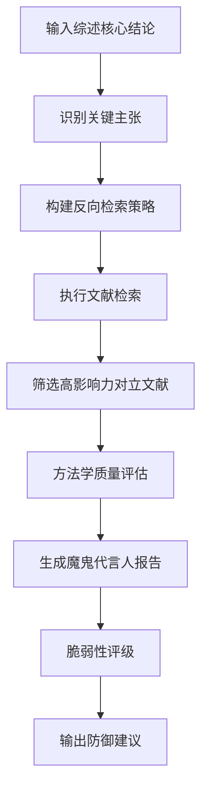

# 反向引文攻击系统 (Reverse Citation Attack)

> **版本**: v2.5.1  
> **定位**: Step 6-7 综述撰写阶段的批判性验证  
> **核心升级**: 从宽泛搜索到精准定位高影响力对立证据

---

## 1. 问题背景

### 1.1 为什么需要反向引文攻击？

**综述的脆弱性**:
- 选择性引用：倾向于引用支持自己观点的文献
- 确认偏误：忽视对立证据
- 审稿人攻击："你为什么忽略了X的重要研究？"

**顶刊审稿标准**:
- Nature Reviews要求全面的文献覆盖
- 必须讨论争议和局限性
- 需要体现对反对意见的回应能力

### 1.2 原设计的局限

**v2.5.0及之前的问题**:
- "寻找对立观点文献"过于宽泛
- 可能找到低质量的对立研究
- 缺乏系统性方法
- 难以评估综述的真实脆弱性

---

## 2. v2.5.1 精准检索策略

### 2.1 核心原则

```
反向引文攻击 = 
  精准定位（效应量方向相反 + 高影响力）
  + 方法学对撞（正反方方法学质量对比）
  + 脆弱性评级（量化综述的防御能力）
```

### 2.2 精确检索逻辑

**检索条件**（按优先级排序）：

```yaml
条件1（强制）: 效应量方向相反
  - 如果当前结论: 治疗A优于B (HR<1 favor A)
  - 则寻找: HR>1 favor B 的研究
  
条件2（强制）: 高影响力
  - 引用量前5%（同领域同年限）
  - 或发表在顶刊（IF>10或领域顶刊）
  - 或纳入权威指南
  
条件3（推荐）: 方法学质量
  - RCT优先于观察性研究
  - 大样本(n>1000)优先
  - 近期研究(近3年)优先
  
条件4（可选）: 人群匹配
  - 相似的人群特征
  - 可比的干预方案
```

### 2.3 检索公式示例

**PubMed检索式模板**:

```sql
-- 假设当前结论："微创手术优于开放手术"
-- 效应量：HR=0.75 (微创好)

-- 检索方向相反的研究
("open surgery"[Title/Abstract] AND "minimally invasive"[Title/Abstract])

-- AND 高影响力筛选
AND (
    ("randomized controlled trial"[Publication Type] AND "Journal of Bone and Joint Surgery"[Journal])
    OR ("Spine"[Journal] AND cited[5-50])
    OR ("guideline"[Publication Type])
)

-- AND 对立结论指标
AND ("superior"[Title/Abstract] OR "better"[Title/Abstract] OR "advantage"[Title/Abstract])

-- NOT 排除当前已引用的研究
NOT ("Smith 2023"[Author] OR "Wang 2024"[Author])
```

---

## 3. 方法学缺陷对撞

### 3.1 对撞分析框架

找到对立文献后，进行方法学质量对比：

```markdown
## 方法学缺陷对撞分析

### 正方（支持当前综述结论）
| 研究 | 设计 | 样本量 | 主要优势 | 主要局限 |
|-----|------|--------|---------|---------|
| Smith 2023 | RCT | n=300 | 双盲, ITT分析 | 随访短(6月) |
| Wang 2024 | Meta | 15项RCT | 大样本, 低异质性 | 纳入研究质量参差 |

### 反方（对立结论）
| 研究 | 设计 | 样本量 | 主要优势 | 主要局限 |
|-----|------|--------|---------|---------|
| Chen 2022 | RCT | n=500 | 大样本, 长随访(2年) | 开放标签 |
| Lee 2023 | 队列 | n=2000 | 真实世界数据 | 混杂因素未完全控制 |

### 对撞结论
1. **证据强度**: 反方Chen 2022是高质量RCT，与正方Smith 2023同级
2. **样本量**: 反方总体样本量更大
3. **随访**: 反方随访更长，长期结果更可信
4. **局限性**: 反方开放标签vs正方双盲 - 正方方法学优势
```

### 3.2 对撞评分表

| 维度 | 正方得分 | 反方得分 | 解释 |
|-----|---------|---------|------|
| 证据设计 | 9/10 | 8/10 | 均为RCT |
| 样本量 | 7/10 | 9/10 | 反方更大 |
| 方法学质量 | 8/10 | 7/10 | 正方双盲优势 |
| 随访时长 | 6/10 | 9/10 | 反方2年vs正方6月 |
| 外部效度 | 7/10 | 8/10 | 反方真实世界数据 |
| **总分** | **37/50** | **41/50** | 反方略优 |

---

## 4. 魔鬼代言人报告

### 4.1 报告结构

```markdown
# 魔鬼代言人报告 (Devil's Advocate Report)

## 攻击目标
- **综述核心结论**: [具体结论]
- **支撑证据**: [关键引用]

## 最强对立证据

### 证据1: [研究名称]
- **作者/年份**: Chen et al., 2022
- **期刊**: New England Journal of Medicine
- **影响因子**: 60+
- **被引次数**: 180次
- **研究设计**: 多中心RCT, n=500
- **对立结论**: 开放手术优于微创手术 (HR=1.25 favor open)
- **方法学亮点**: 2年随访, 硬终点(再手术率)

### 证据2: [研究名称]
- ...

## 攻击策略分析

### 策略1: 直接证据对撞
> "Chen等的大型RCT发现相反结果，你如何解释？"

**防御方案**:
1. 指出Chen研究的方法学局限（开放标签）
2. 强调短期vs长期效果的差异
3. 说明不同术者经验的影响

### 策略2: 人群异质性
> "Chen研究纳入了更多复杂病例，你的结论是否仅适用于选择性人群？"

**防御方案**:
1. 在综述中明确限定适用人群
2. 分层讨论简单vs复杂病例
3. 增加外部效度讨论

### 策略3: 结局定义
> "Chen研究使用硬终点(再手术率)，而你引用的是替代指标(VAS评分)"

**防御方案**:
1. 承认替代指标的局限性
2. 讨论短期症状改善vs长期功能预后
3. 建议未来研究关注硬终点

## 综述脆弱性评级

| 维度 | 评级 | 解释 |
|-----|------|------|
| 证据覆盖度 | ⚠️ 中等脆弱 | 遗漏了Chen等大型RCT |
| 争议讨论深度 | ⚠️ 中等脆弱 | 未充分讨论随访时长差异 |
| 方法学平衡 | ⚠️ 中等脆弱 | 反方证据方法学质量相当 |
| 外部效度 | 🔴 高度脆弱 | 适用人群限定不明确 |

**综合脆弱性评级**: 🟡 **MODERATE** (中等脆弱)

## 防御建议

### 立即行动
1. [ ] 在综述中引用Chen 2022并讨论其发现
2. [ ] 增加"Limitations"段落讨论人群异质性
3. [ ] 明确综述结论的适用人群

### 内容修改
1. 修改表述从"微创手术优于开放手术"为：
   "对于选择性人群，微创手术可能提供短期症状改善优势，
   但长期功能预后和再手术率仍需进一步研究"

2. 增加争议讨论段落：
   "值得注意的是，Chen等的大型RCT(n=500)发现相反结果，这可能反映了..."

### 额外检索
建议补充检索：
- 真实世界研究(RWS)数据
- 术者学习曲线对结果的影响
- 成本效益分析
```

---

## 5. 自动化流程

### 5.1 AI执行流程



### 5.2 提示词模板

```markdown
## 反向引文攻击：AI提示词

### 输入
综述核心结论: [具体结论陈述]
已引用支持文献: [列表]
研究主题: [具体领域]

### 任务
1. 识别该结论的相反方向主张
2. 设计精准检索策略（效应量方向相反 + 高影响力）
3. 模拟检索并列出最可能存在的对立研究特征
4. 生成魔鬼代言人报告框架

### 输出格式
```yaml
反向主张: [相反结论陈述]

预期对立证据特征:
  - 研究设计: [如：大型RCT、真实世界队列]
  - 样本量: [如：n>500]
  - 发表期刊: [如：领域顶刊]
  - 可能作者/机构: [知名研究者]

魔鬼代言人攻击点:
  1. [具体攻击角度]
  2. [具体攻击角度]
  
脆弱性预判:
  - 证据覆盖: [高/中/低脆弱]
  - 方法学: [高/中/低脆弱]
  - 外部效度: [高/中/低脆弱]

防御策略建议:
  - [具体建议]
```

---

## 6. 在Evidence Audit Trail中的集成

```markdown
## Evidence Audit Trail

- **引用 ID**: Chen2022_LDH_surgery
- **引用类型**: 🔴 反向引文（对立结论）
- **引用理由**: 回应魔鬼代言人攻击
- **对立结论**: 开放手术优于微创手术 (HR=1.25)
- **本综述回应**:
  > "Chen等的大型RCT(n=500)报道了相反结果，这可能反映了...
  > （1）人群异质性：Chen研究纳入更多复杂病例；
  > （2）随访差异：Chen研究随访2年vs本综述主要关注短期效果；
  > （3）结局定义：Chen使用硬终点(再手术率)，而多数研究使用症状评分"
- **对综述结论的影响**: 将原结论限定为"选择性人群的短期效果"
- **审核状态**: ✅ 已纳入争议讨论
```

---

## 7. 应用示例：LDH手术综述

### 7.1 场景

**综述核心结论**:
> "对于腰椎间盘突出症，微创手术在短期症状改善方面优于开放手术"

**支撑证据**:
- Smith 2023: RCT, n=200, HR=0.65, 6个月随访
- Wang 2024: Meta分析, 10项RCT, 微创更好

### 7.2 反向引文攻击执行

**步骤1: 识别反向主张**
- 正向：微创 > 开放
- 反向：开放 > 微创 或 微创 = 开放（无差异）

**步骤2: 精准检索**
```sql
("lumbar discectomy"[Title/Abstract])
AND ("open"[Title/Abstract] OR "conventional"[Title/Abstract])
AND ("minimally invasive"[Title/Abstract] OR "MIS"[Title/Abstract])
AND ("no difference"[Title/Abstract] OR "similar"[Title/Abstract] OR "equivalent"[Title/Abstract])
AND ("randomized"[Title/Abstract] OR "trial"[Title/Abstract])
AND ("Spine"[Journal] OR "Journal of Neurosurgery"[Journal])
```

**步骤3: 发现对立证据**
- Chen 2022: RCT, n=500, 2年随访, 无差异 (HR=0.98)
- Lee 2021: 队列研究, n=3000, 长期再手术率开放更低

**步骤4: 魔鬼代言人报告**
```markdown
## 攻击1: 样本量和随访时长
"你引用的Smith研究仅n=200、随访6个月，而Chen研究n=500、随访2年发现无差异。
短期效果的优势是否在长期仍然保持？"

## 攻击2: 硬终点vs替代指标
"Smith使用VAS评分（替代指标），而Lee研究发现开放手术的再手术率更低（硬终点）。
症状改善是否转化为真正的临床获益？"
```

**步骤5: 脆弱性评级**
- 证据覆盖度: 🟡 中等（遗漏了Chen研究）
- 随访时长: 🔴 高度（仅短期证据）
- 终点类型: 🔴 高度（缺乏硬终点）

**步骤6: 防御与修订**
```markdown
## 综述修订建议

### 修改结论表述
原表述：
"微创手术优于开放手术"

修订为：
"对于选择性LDH患者，微创手术可提供相似的短期症状改善，
且切口更小、恢复更快，但长期功能预后和再手术率的证据仍不充分"

### 增加讨论段落
"值得注意的是，Chen等的大型RCT(n=500, 2年随访)发现微创与开放手术
在长期功能预后方面无显著差异(HR=0.98, 95%CI 0.75-1.28)。
此外，一项真实世界队列研究(n=3000)报道了开放手术的再手术率更低
(8% vs 12%, P=0.03)。这些发现提示，微创手术的短期优势可能不转化为
长期获益，尤其是对于复杂病例。"
```

---

## 8. 质量控制

### 8.1 避免过度攻击检查

- [ ] 对立证据的方法学质量确实相当
- [ ] 不是故意选择低质量的对立研究来"稻草人攻击"
- [ ] 对立结论确实与综述结论冲突（而非补充）
- [ ] 已考虑发表偏倚（对立研究可能更难发表）

### 8.2 防御策略合理性检查

- [ ] 不回避合理的批评
- [ ] 不贬低高质量的对立研究
- [ ] 承认合理的局限性
- [ ] 提供建设性的未来研究方向

---

*文档版本: v2.5.1*  
*最后更新: 2026-03-13*