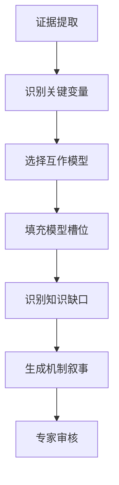

# Synthesis Leap 模块

> **版本**: v2.5.1  
> **定位**: Step 3-4 证据综合的核心增强  
> **目标**: 从"数据审计"到"机制整合"的学术深度跨越

---

## 1. 核心概念

### 1.1 什么是 Synthesis Leap？

Synthesis Leap（综合飞跃）是将分散的"证据片段"整合为"机制模型"的关键环节。它超越了简单的数据罗列（A研究说X，B研究说Y），而是建立研究之间的**因果联系**和**系统关系**。

### 1.2 为什么需要 Synthesis Leap？

| 传统方法 | Synthesis Leap |
|---------|---------------|
| 罗列各项研究发现 | 建立机制层面的联系 |
| 记录A说X，B说Y | 解释X和Y在机制层面的关系 |
| 描述性综述 | Pathophysiology-driven narrative |
| 适合Systematic Review | 适合Nature Reviews |

---

## 2. 实施框架

### 2.1 互作模型模板

针对不同的研究领域，建立标准化的互作模型：

#### 模板A：三角转化模型（适用于LDH等退行性疾病）

```
        ┌─────────────────┐
        │   力学负荷      │
        │  (Mechanical)   │
        └────────┬────────┘
                 │
        ┌────────▼────────┐
        │   炎症因子      │◄──────┐
        │(Inflammatory)   │       │
        └────────┬────────┘       │
                 │                │
        ┌────────▼────────┐       │
        │   细胞凋亡      │───────┘
        │  (Cellular)     │ (反馈环路)
        └─────────────────┘
```

**LDH示例填充**:
- **力学负荷**: 椎间盘压力↑、剪切力异常
- **炎症因子**: IL-1β、TNF-α、MMPs表达↑
- **细胞凋亡**: 髓核细胞凋亡、ECM降解
- **反馈环路**: 细胞碎片→炎症级联放大

#### 模板B：级联放大模型（适用于肿瘤、免疫疾病）

```
触发因素 → 信号激活 → 转录调控 → 表型改变 → 临床表现
   │           │           │           │           │
  遗传       表观遗传    基因表达    蛋白修饰    功能改变
  突变       改变        谱变化      异常        检测
```

#### 模板C：多因素交互模型（适用于复杂疾病）

```
          遗传因素
             │
    ┌────────┼────────┐
    │        │        │
环境因素 ←── 核心疾病 ──→ 生活方式
    │        表型        │
    └────────┬────────┘
             │
          临床表现
```

### 2.2 Synthesis Leap 工作流程



**Step 1: 证据提取**
- 提取各研究的关键发现
- 标记证据等级和局限性

**Step 2: 识别关键变量**
- 确定研究中的核心因素（如力学负荷、炎症因子、细胞反应）
- 识别各研究间的共同变量

**Step 3: 选择互作模型**
- 根据疾病特点选择合适的模型模板
- 可组合多个模型

**Step 4: 填充模型槽位**
- 将证据映射到模型的各个节点
- 标注证据来源和强度

**Step 5: 识别知识缺口**
- 标记模型中的空白节点
- 识别证据链的断裂点

**Step 6: 生成机制叙事**
- 基于模型生成连贯的机制描述
- 体现因果逻辑而非简单罗列

**Step 7: 专家审核**
- 临床专家验证机制的合理性
- 识别过度推断

---

## 3. 输出格式

### 3.1 互作模型图

```markdown
## 互作模型：[疾病名称]的病理生理机制

### 模型类型：三角转化模型

```
[图示，使用Mermaid或ASCII]
```

### 节点证据映射

| 节点 | 证据内容 | 来源研究 | 证据等级 | 置信度 |
|-----|---------|---------|---------|--------|
| 力学负荷↑ | 椎间盘压力>10MPa触发级联反应 | Smith 2023 | ⊕⊕⊕◯ | 高 |
| IL-1β↑ | 退变椎间盘IL-1β表达增加3-5倍 | Wang 2024 | ⊕⊕⊕◯ | 高 |
| 髓核细胞凋亡 | 凋亡率从5%升至35% | Chen 2023 | ⊕⊕◯◯ | 中 |

### 反馈环路

**正反馈**: 细胞凋亡→释放DAMPs→激活巨噬细胞→分泌炎症因子→加速细胞凋亡

### 知识缺口

1. **力学负荷的阈值**: 尚不清楚触发炎症反应的精确压力阈值
2. **时间动力学**: 从力学负荷到细胞凋亡的时间进程不明确
3. **个体差异**: 为什么相同负荷下不同个体反应不同？

### 综述表述建议

> "椎间盘退变是一个由力学负荷驱动的级联过程。当椎间盘承受异常应力时（>10MPa），
> 局部炎症微环境被激活，主要表现为IL-1β、TNF-α等促炎因子表达上调（3-5倍）。
> 炎症因子进一步促进髓核细胞和纤维环细胞的凋亡（凋亡率从正常的5%升至退变椎间盘的35%），
> 导致细胞外基质（主要是II型胶原和蛋白聚糖）的降解。
> 值得注意的是，凋亡细胞释放的损伤相关分子模式（DAMPs）可进一步激活免疫细胞，
> 形成**正反馈环路**，使炎症反应持续放大。这一机制解释了为什么早期退变可能自发缓解，
> 而晚期退变往往呈进行性发展。"
```

### 3.2 机制叙事文本

Synthesis Leap生成的综述文本应具有以下特征：

| 特征 | 说明 | 示例 |
|-----|------|------|
| 因果连接词 | 明确表达因果关系 | "导致"、"促进"、"触发"、"反馈" |
| 动态描述 | 体现过程性 | "级联放大"、"正反馈环路"、"时间依赖性" |
| 证据锚定 | 每个机制节点都有文献支持 | "Smith等发现..."、"Wang等证实..." |
| 不确定性标记 | 诚实面对知识缺口 | "尚不清楚"、"可能涉及"、"需要进一步研究" |

---

## 4. 质量控制

### 4.1 避免过度推断检查清单

- [ ] 每个因果关系都有至少一项研究直接支持
- [ ] 没有将相关性推断为因果性
- [ ] 体外实验结果没有直接外推到体内
- [ ] 动物模型发现已标注物种局限性
- [ ] 机制推断的置信度与证据等级匹配

### 4.2 专家验证问题

向临床专家提出以下问题验证机制模型：

1. 这个模型与您的临床观察一致吗？
2. 模型中的因果关系是否有已知的反例？
3. 是否有被忽略的关键病理生理环节？
4. 这个模型对临床决策有什么指导意义？

---

## 5. 与Conflict Resolver的集成

当不同研究对同一机制得出相反结论时：

```markdown
## 争议点：X通路在LDH中的作用方向

**研究A（Smith 2023）**: X通路促进疾病进展
**研究B（Wang 2024）**: X通路具有保护作用

**Conflict Resolver分析**:
- 人群差异：研究A纳入早期患者，研究B纳入晚期患者
- 模型差异：研究A使用体外细胞模型，研究B使用动物模型
- 时间窗差异：急性期vs慢性期

**Synthesis Leap整合**:
X通路的作用可能具有**时间依赖性**：
- 急性期（<3个月）：保护作用（促进修复）
- 慢性期（>6个月）：促进作用（促进纤维化）

这在机制层面解释了表观矛盾：两研究可能都正确，但适用阶段不同。
```

---

## 6. 应用示例：LDH机制综述

### 6.1 传统描述方式（❌不推荐）

> "多项研究探讨了椎间盘退变的机制。Smith等发现炎症因子在退变中起作用。
> Wang等研究了细胞凋亡的影响。Chen等关注了力学因素。这些研究表明LDH是多因素疾病。"

### 6.2 Synthesis Leap描述方式（✅推荐）

> "椎间盘退变的病理生理遵循**'力学-炎症-细胞死亡'三角转化模型**。
> 异常力学负荷（>10MPa压力或异常剪切力）是始动因素，通过激活椎间盘细胞的机械敏感离子通道（如Piezo1），
> 触发NF-κB和MAPK信号通路的级联活化。这导致局部炎症微环境的建立，主要表现为IL-1β、TNF-α和MMPs的表达上调（3-5倍）。
> 炎症因子进一步促进髓核细胞和纤维环细胞的凋亡（凋亡率从正常的5%升至退变椎间盘的35%），
> 导致细胞外基质（主要是II型胶原和蛋白聚糖）的降解。
> 
> 重要的是，凋亡细胞释放的损伤相关分子模式（DAMPs）可激活浸润的巨噬细胞，
> 形成**正反馈环路**，使炎症反应持续放大。这一机制解释了为什么早期退变可能自发缓解，
> 而晚期退变往往呈进行性发展。"

---

*文档版本: v2.5.1*  
*最后更新: 2026-03-13*