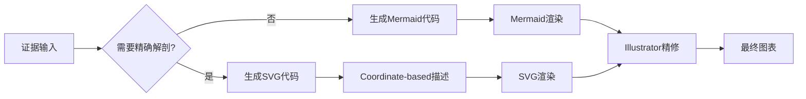
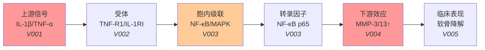
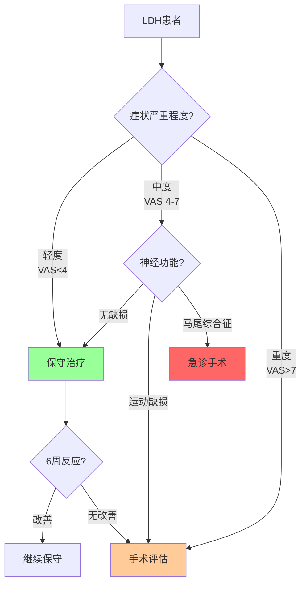
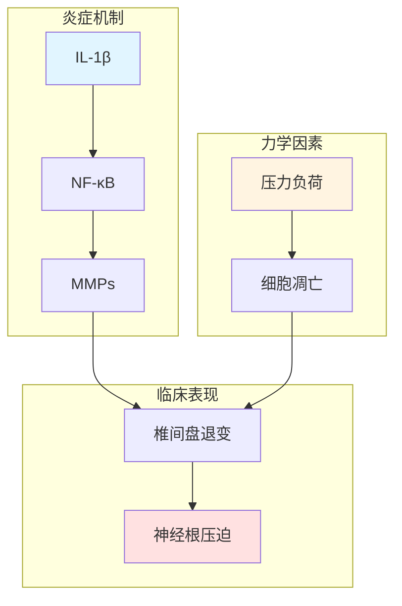
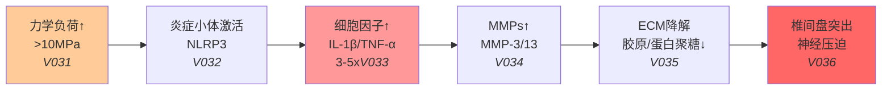

# 视觉逻辑引擎：SVG + Mermaid 混合模式

> **版本**: v2.5.1  
> **定位**: Step 5+ 视觉逻辑引擎的学术级实现  
> **核心升级**: 从BioRender自动化到SVG + Mermaid混合模式

---

## 1. 背景：为什么放弃BioRender自动化？

### 1.1 BioRender的局限性

**技术现实**:
- BioRender目前没有开放底层图层控制的API
- AI输出的"图层描述规范"无法直接转化为可编辑的图片
- 用户仍需手动在BioRender中重建
- "自动化"名不副实

**用户反馈**:
```
问题：AI生成了详细的BioRender图层描述
现实：用户仍需手动拖拽每个元素
结果：节省的时间有限，且需要学习BioRender操作
```

### 1.2 SVG + Mermaid混合模式的优势

| 维度 | BioRender描述 | SVG + Mermaid |
|-----|--------------|---------------|
| 可直接使用 | ❌ 需手动重建 | ✅ SVG代码直接可用 |
| 编辑灵活性 | 依赖BioRender平台 | 任意矢量软件(Illustrator/Inkscape) |
| 精确控制 | 模糊描述 | Coordinate-based精确坐标 |
| 学术期刊接受 | 需导出 | SVG/PDF直接提交 |
| 版本控制 | 困难 | 文本可版本控制 |

---

## 2. 架构设计

### 2.1 混合模式概念

```
SVG + Mermaid 混合模式 =
  Mermaid (逻辑结构图) 
  + SVG (精确解剖图) 
  + Coordinate-based Drawing (坐标驱动)
```

**分工**:
- **Mermaid**: 流程图、信号通路、决策树等逻辑结构
- **SVG**: 解剖图、病理示意图等需要精确视觉呈现的内容
- **Coordinate-based Drawing**: 脊柱解剖的精确坐标描述

### 2.2 工作流程



---

## 3. Mermaid 部分

### 3.1 适用场景

- 信号通路图
- 临床决策树
- 研究流程图
- 证据整合图
- 时间线

### 3.2 模板库

#### 模板A：细胞信号通路



#### 模板B：临床决策树



#### 模板C：证据整合图



### 3.3 Mermaid生成规范

```markdown
## Mermaid图表生成要求

### 1. 节点标注
- 内容：核心概念
- 证据标签：<i>Vxxx</i> 格式，关联Evidence Audit Trail
- 样式：根据证据强度着色

### 2. 颜色规范
```css
/* 证据强度颜色 */
高确定性 (Grade A): fill:#99ff99  /* 绿色 */
中确定性 (Grade B): fill:#ffff99  /* 黄色 */
低确定性 (Grade C): fill:#ffcc99  /* 橙色 */
极低确定性 (Grade D): fill:#ff9999 /* 红色 */
争议/不确定: fill:#cccccc         /* 灰色 */
```

### 3. 布局原则
- 逻辑流向：左→右 或 上→下
- 反馈环路：明确标注
- 争议点：用不同颜色/线型区分
```

---

## 4. SVG 部分

### 4.1 适用场景

- 脊柱解剖示意图
- 手术入路示意图
- 病理改变示意图
- 影像学测量标注

### 4.2 Coordinate-based Drawing

**核心思想**: 用精确坐标描述每个解剖结构，而非模糊语言

#### LDH解剖模板

```svg
<svg viewBox="0 0 400 500" xmlns="http://www.w3.org/2000/svg">
  <!-- 背景 -->
  <rect width="400" height="500" fill="#f8f9fa"/>
  
  <!-- 标题 -->
  <text x="200" y="30" text-anchor="middle" font-size="16" font-weight="bold">
    腰椎间盘突出症 - 解剖示意图
  </text>
  
  <!-- 椎体 (L4) -->
  <rect x="120" y="80" width="160" height="60" rx="5" 
        fill="#e8d5c4" stroke="#8b4513" stroke-width="2"/>
  <text x="200" y="115" text-anchor="middle" font-size="12">L4椎体</text>
  
  <!-- 椎间盘 (L4/5) -->
  <rect x="125" y="145" width="150" height="40" rx="3"
        fill="#ffd700" stroke="#cc9900" stroke-width="2"/>
  <text x="200" y="170" text-anchor="middle" font-size="11">L4/5椎间盘</text>
  
  <!-- 椎体 (L5) -->
  <rect x="120" y="190" width="160" height="60" rx="5"
        fill="#e8d5c4" stroke="#8b4513" stroke-width="2"/>
  <text x="200" y="225" text-anchor="middle" font-size="12">L5椎体</text>
  
  <!-- 椎间盘突出 (右侧后外侧) -->
  <path d="M 260 165 Q 290 155 300 180 Q 310 205 275 200 Z"
        fill="#ff6b6b" stroke="#cc0000" stroke-width="2" opacity="0.8"/>
  <text x="305" y="185" font-size="10" fill="#cc0000">突出</text>
  
  <!-- 脊髓/马尾神经 -->
  <ellipse cx="200" cy="160" rx="40" ry="15"
           fill="#ffb6c1" stroke="#ff1493" stroke-width="1.5"/>
  <text x="200" y="165" text-anchor="middle" font-size="10">硬膜囊</text>
  
  <!-- 受压的神经根 (L5) -->
  <path d="M 260 160 Q 280 160 295 200"
        fill="none" stroke="#4169e1" stroke-width="4" stroke-linecap="round"/>
  <circle cx="295" cy="200" r="5" fill="#ff0000"/>
  <text x="310" y="205" font-size="10" fill="#4169e1">L5神经根</text>
  <text x="305" y="220" font-size="9" fill="#ff0000">受压</text>
  
  <!-- 黄韧带 -->
  <path d="M 125 145 L 125 185 L 145 175 L 145 155 Z"
        fill="#deb887" stroke="#8b7355" stroke-width="1"/>
  <path d="M 275 145 L 275 185 L 255 175 L 255 155 Z"
        fill="#deb887" stroke="#8b7355" stroke-width="1"/>
  <text x="105" y="168" font-size="9" fill="#8b7355" transform="rotate(-90 105 168)">
    黄韧带
  </text>
  
  <!-- 椎管径线标注 -->
  <line x1="160" y1="140" x2="240" y2="140" stroke="#333" stroke-width="1"/>
  <line x1="160" y1="135" x2="160" y2="145" stroke="#333" stroke-width="1"/>
  <line x1="240" y1="135" x2="240" y2="145" stroke="#333" stroke-width="1"/>
  <text x="200" y="135" text-anchor="middle" font-size="10">椎管前后径</text>
  
  <!-- 图例 -->
  <g transform="translate(20, 320)">
    <text x="0" y="0" font-size="12" font-weight="bold">图例</text>
    
    <rect x="0" y="15" width="20" height="15" fill="#e8d5c4" stroke="#8b4513"/>
    <text x="25" y="27" font-size="10">椎体</text>
    
    <rect x="0" y="40" width="20" height="15" fill="#ffd700" stroke="#cc9900"/>
    <text x="25" y="52" font-size="10">椎间盘</text>
    
    <path d="M 0 75 L 20 70 L 25 80 L 5 85 Z" fill="#ff6b6b" stroke="#cc0000"/>
    <text x="30" y="80" font-size="10">椎间盘突出</text>
    
    <line x1="5" y1="100" x2="20" y2="95" stroke="#4169e1" stroke-width="3"/>
    <text x="25" y="100" font-size="10">神经根</text>
  </g>
  
  <!-- 参考文献标注 -->
  <text x="200" y="480" text-anchor="middle" font-size="9" fill="#666">
    基于 Netter 解剖学图谱 | 参考文献见 V023-V027
  </text>
</svg>
```

### 4.3 坐标规范

```markdown
## Coordinate-based Drawing 规范

### 画布设置
- 标准尺寸: 400 x 500 (可缩放)
- 坐标系: 左上角为原点 (0,0)
- 单位: 像素

### 脊柱解剖坐标参考

#### 椎体
```
标准椎体矩形:
- x: 120 (水平中心位置)
- y: 根据节段变化 (L1:80, L2:190, L3:300...)
- width: 160
- height: 60
- rx: 5 (圆角)
```

#### 椎间盘
```
标准椎间盘:
- x: 125 (椎体中心 + 5)
- y: 椎体底部 + 5
- width: 150
- height: 40
```

#### 椎管
```
标准椎管椭圆:
- cx: 200 (水平中心)
- cy: 椎间盘中心
- rx: 40 (半宽)
- ry: 15 (半高)
```

### 突出位置坐标

| 位置 | 坐标描述 | 示例 |
|-----|---------|------|
| 中央型 | 椎管中心偏上 | cx=200, cy=160, 向上偏移 |
| 后外侧型(左) | 椎管左侧，偏后 | x=140, y=160 |
| 后外侧型(右) | 椎管右侧，偏后 | x=260, y=160 |
| 极外侧型 | 椎管外侧 | x=300, y=160 |
| 游离型 | 下方间隙 | y=椎间隙 + 20 |
```

---

## 5. 生成流程

### 5.1 AI工作流程

```markdown
## 视觉逻辑引擎执行流程

### Step 1: 分析需求
输入: Evidence Audit Trail中的关键发现
分析:
- 需要展示什么机制/流程/结构？
- 需要精确解剖还是逻辑关系？

### Step 2: 选择模式
决策:
- 纯逻辑关系 → Mermaid
- 精确解剖图 → SVG
- 两者结合 → Mermaid + SVG

### Step 3: 生成代码
对于Mermaid:
1. 选择匹配模板
2. 填充证据槽位 (Vxxx)
3. 应用颜色规范

对于SVG:
1. 选择解剖模板
2. 根据具体病例调整坐标
3. 标注关键测量值

### Step 4: 图表-数据锚点映射
输出:
```yaml
图表映射:
  - 图表: Figure1_mechanism
    类型: Mermaid
    关联证据: [V001, V002, V003, V004, V005]
    可编辑性: 高
  
  - 图表: Figure2_anatomy
    类型: SVG
    关联证据: [V023, V024, V025]
    可编辑性: 中（需矢量软件）
```

### Step 5: 精修指南
对于SVG图表，提供精修指南:
- 建议使用的软件 (Illustrator/Inkscape)
- 可修改的元素列表
- 保持不变的锚定元素
```

### 5.2 示例执行

**输入**:
```markdown
需要展示LDH的病理生理机制：
- 力学负荷触发炎症
- IL-1β和TNF-α上调
- MMPs导致基质降解
- 神经根受压
```

**输出**:

1. **Mermaid信号通路**:


2. **SVG解剖示意图** (见4.2节代码)

3. **精修指南**:
```markdown
## Figure2_anatomy 精修指南

### 可修改内容
- 颜色主题 (保持突出物为红色系)
- 标注文字位置和大小
- 添加更多解剖细节 (关节突、棘突等)

### 必须保留
- 椎管径线标注位置
- 突出物相对位置
- 神经根受压点

### 建议添加
- 椎间孔狭窄程度标注
- 椎间盘高度测量线
- 与临床症状的对应标注
```

---

## 6. 质量控制

### 6.1 解剖准确性检查

- [ ] 椎体数量和位置正确
- [ ] 椎间盘位置在椎体之间
- [ ] 神经根出口位置正确
- [ ] 突出物位置与描述一致
- [ ] 测量标注位置合理

### 6.2 证据一致性检查

- [ ] 图中标注与Evidence Audit Trail一致
- [ ] 效应方向（上调/下调）正确
- [ ] 争议点用不同颜色标注
- [ ] 证据标签(Vxxx)可追踪

---

## 7. 输出格式

```markdown
## 视觉逻辑引擎输出

### 图表1: LDH病理机制信号通路
**类型**: Mermaid
**用途**: 展示分子机制
**代码**: [mermaid代码块]
**预览**: [渲染后的图表]
**证据映射**:
- V031: Smith 2023 - 压力阈值
- V032: Wang 2024 - NLRP3激活
- ...

### 图表2: LDH解剖示意图
**类型**: SVG
**用途**: 展示解剖结构和病理改变
**代码**: [svg代码块]
**精修指南**: [见上文]
**证据映射**:
- V023: Chen 2023 - 突出类型分布
- V024: Lee 2022 - 椎管径线测量

### 使用说明
1. Mermaid图表可直接复制到支持Mermaid的编辑器查看
2. SVG代码可保存为.svg文件，用浏览器或矢量软件打开
3. 建议将SVG导入Adobe Illustrator进行精修后提交期刊
```

---

*文档版本: v2.5.1*  
*最后更新: 2026-03-13*